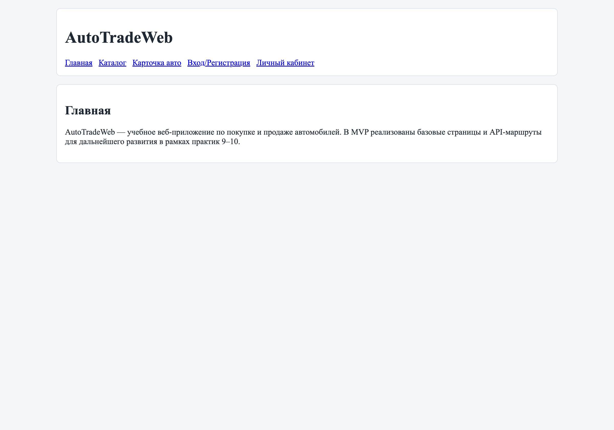
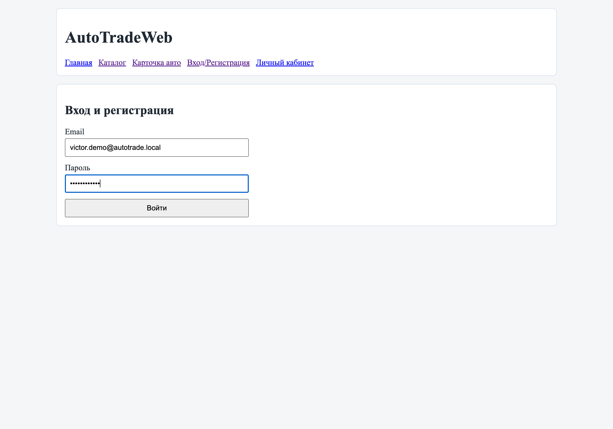
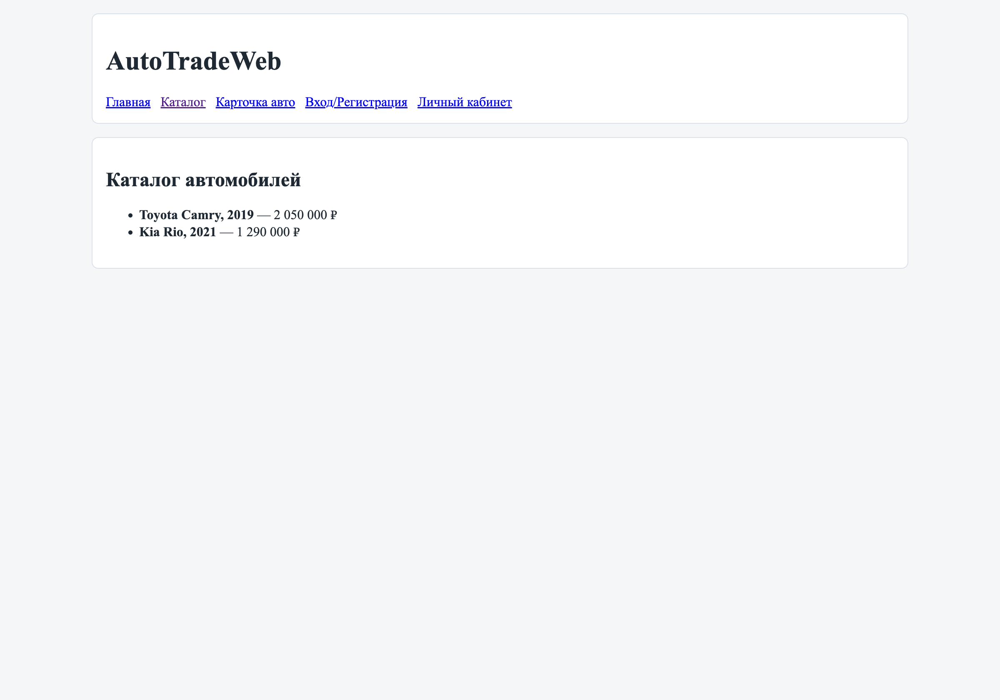
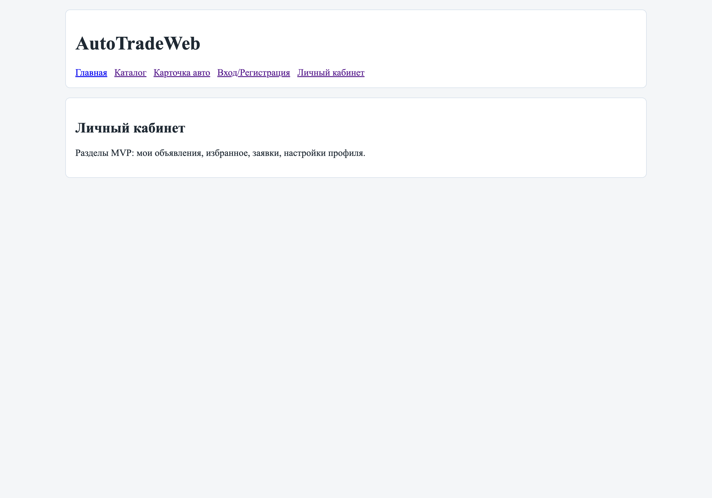

# Начало работы

## Шаг 1. Откройте главную страницу

Перейдите на главную страницу AutoTradeWeb.

## Шаг 2. Вход и регистрация

Перейдите в раздел **«Вход/Регистрация»** через верхнее меню.

1. Нажмите пункт меню **«Вход/Регистрация»**.
2. Введите email и пароль.
3. Нажмите кнопку **«Войти»**.

## Шаг 3. Переход в каталог автомобилей

После входа откройте раздел **«Каталог»**.

## Шаг 4. Просмотр личного кабинета

Для перехода к профилю нажмите пункт меню **«Личный кабинет»**.

## Навигация

- [Home](Home)
- [О системе](About)
- [Руководство покупателя](Buyer-Guide)
