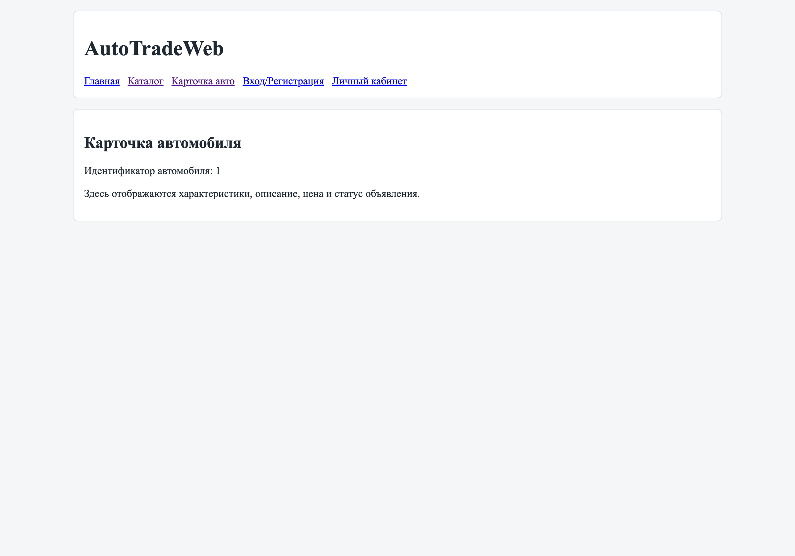

# Руководство продавца

## Цель роли

Продавец работает с объявлениями и контролирует публикацию автомобилей в системе.

## Основной сценарий продавца (учебный MVP)

1. Перейдите в раздел **«Вход/Регистрация»** и выполните вход.
2. Откройте **«Личный кабинет»** для перехода к действиям продавца.
3. Проверьте карточку автомобиля через раздел **«Карточка авто»** перед публикацией.
4. После проверки параметров продолжайте работу с объявлениями согласно правилам проекта.

> В текущем MVP интерфейс создания/редактирования объявлений показан упрощённо, но роли и сценарий продавца сохраняются в документации проекта.

## Навигация

- [Home](Home)
- [О системе](About)
- [FAQ](FAQ)
